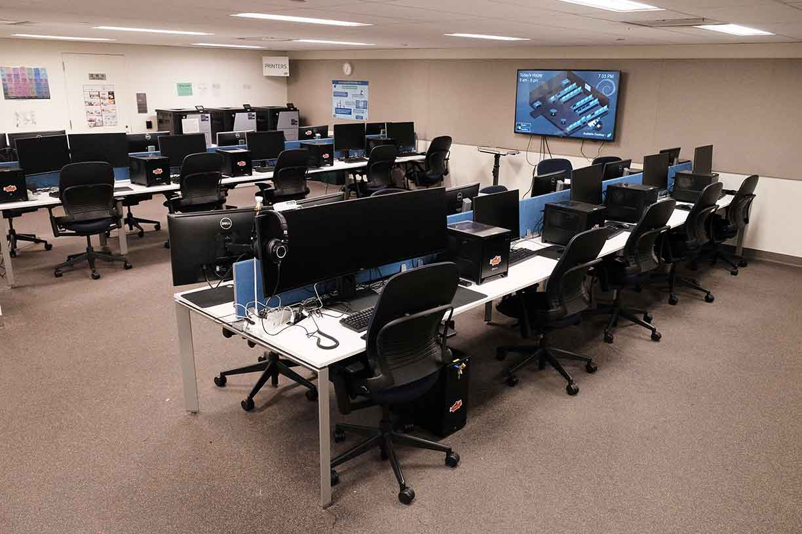

---
# Dynamic boxes are in home.html

layout: home
---

{::options parse_block_html="true" /}

# The Lab
## Located at 171 MLK Student Union

Find out how to [get there](). Just show your Cal ID at the door!

# About us
## [See more »]()

The Open Computing Facility is an all-volunteer student organization located at the University of California, Berkeley. We're passionate about open source and free software. 

Our volunteers maintain services for the Berkeley community. Among others, we offer: 

* [A spiffy computer lab]() in 171 MLK Student Union
* [Web & email hosting]() for thousands of student groups and individuals
* [Free printing]() for all UC Berkeley students
* [Shell accounts]() on our powerful [on-campus servers]()
* [High-performance]() computing on our GPU server
* ...and [lots more]()!

We hold weekly staff hours to provide assistance with account issues or with OCF services. Drop by to ask questions or just to hang out! 

# Join Staff!
## Meetings 8PM every Monday in the lab

We meet every week to talk tech and work on cool projects. All are welcome to join OCF staff, at any point in the semester! 

## **Sound interesting?**
* Subscribe to our [mailing list]() for meeting recaps
* Chat with us on [Slack]() or [IRC]()
* Drop by and say hello, or [email]() the staff team
* See more ways to [contribute and get involved]()

# Linux SysAdmin Decal
## [See more »]()

Whether you are looking to improve your Bash wizardry, just plain GNU, or everything Unix and Unix-like, this is the perfect class for you. We offer a beginner section for those new to Unix and an advanced section for those who have some experience but want to learn more. Both sections are 2 units and be held from 8-9pm, the beginner section on Tuesdays and the advanced section on Thursdays, right in the OCF lab. 

